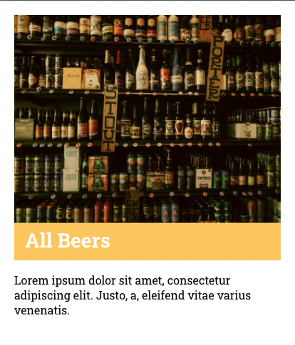

# Bootcamp Exercise - Beers

## Table of contents

- [Overview](#overview)
  - [The challenge](#the-challenge)
  - [Screenshot](#screenshot)
  - [Links](#links)
- [My process](#my-process)
  - [Built with](#built-with)
  - [What I learned](#what-i-learned)
  - [Continued development](#continued-development)

## Overview

### The challenge

Users should be able to:

- Build a page about different beers
- Use React routing
- Use an API 

### Screenshot

### Links

- Solution URL: [https://beer-page.netlify.app/]

## My process

### Built with

- Semantic HTML5 markup
- SCSS
- Flexbos
- JavaScript
- React
- Fetch

### What I learned

How to implement an API and use fetches in React. Also how to use Routing in React. 

### Continued development

I guess the styling could be slimmed down. 

